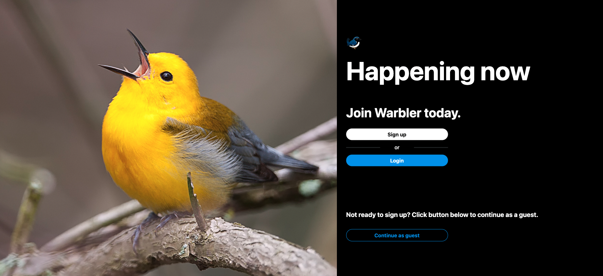

# Warbler Social App

## Description

The Warbler Social App is a twitter clone social media experience. It uses Bcrypt for authentication and SQLAlchemy for database management. It runs off of a Flask server and uses Jinja for template-based page rendering.

The site is deployed on Heroku and can be found [here](https://warbler-social-app.herokuapp.com/)

## Data Source / API

The Warbler Social App utilizes a news [API](https://newsapi.org/) in order to pull current headlines under the What's Happening section.

The tech stack is a Python back end using Flask, with server rendered jinja pages. The app uses Bcrypt for authentication and SQLAlchemy for database management.

## Functionality

- Create user profile
- Search Warbler for other users.
- Create messages and interact with other users.

## User Flow

1. Landing Page - Signup/Login to user account.
2. User Sign-Up Page - Allows user to create personal profile/account.
3. User Login Page - Allows user to login to existing profile/account.
4. Home Page - Allows user to search for other users and create messages.
5. Users Profile Page - User can see their information as well as followers, following, messages, and likes.
